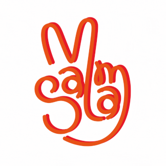

  <a href="https://salamsibai.github.io">
  

<h2 align="center"> Game Designer and Developer 🎮 Ms in Computer Science student at DigiPen Institute of Technology 👩🏻‍💻 42 Abu Dhabi Student </h2>

<h3 align ="center">Tools and languages</h3>

           

<!--
**SalamSibai/SalamSibai** is a ✨ _special_ ✨ repository because its `README.md` (this file) appears on your GitHub profile.

Here are some ideas to get you started:

- 🔭 I’m currently working on ...
- 🌱 I’m currently learning ...
- 👯 I’m looking to collaborate on ...
- 🤔 I’m looking for help with ...
- 💬 Ask me about ...
- 📫 How to reach me: ...
- 😄 Pronouns: ...
- ⚡ Fun fact: ...
-->
